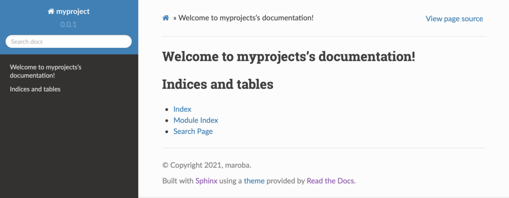

# manati

A command line interface (CLI) for managing Python projects.

 

[](https://badge.fury.io/py/manati)


[](https://manati.readthedocs.io/en/latest/index.html)
[](https://pepy.tech/project/manati)

**Create** new Python projects with ready-to-go recommended project structure. 

**Add** important files to existing projects
like `setup.py`, `.gitignore`, Sphinx documentation, choose a license and more.

**Run** test suites, analyze test coverage and **deploy** to PyPi.

Even *manati* is managed using *manati*... so meta.

## Installation

```
pip install --upgrade manati
```

## Documentation

The full documentation can be found [here](https://manati.readthedocs.io/en/latest/).


## Usage

### Creating a new project

```
manati create -n myproject
```

creates a complete Python project structure inside the current working directory:

```
myproject
├── docs
│   ├── Makefile
│   ├── conf.py
│   ├── index.rst
│   ├── make.bat
│   └── requirements.txt
├── myproject
│   ├── __init__.py
│   └── main.py
├── LICENSE
├── README.md
├── setup.py
├── .gitignore
└── tests
    └── test_main.py
```

including sample source,
tests, documentation, `setup.py`, local `git` repository and a
suitable `.gitignore` file.

After creation, the project is already installed in development (editable) mode, so you can start coding right away.


### Adding stuff to an existing project

Sometimes you have an existing project, but initially you did not choose a license,
or your `.gitignore` is missing. You can add those special files with the `manati add` command.

#### Add a project documentation folder

```
manati add docs
```

makes a `./docs` folder and sets up a *Sphinx*-based documentation in `Read-The-Docs`-style:



Call `manati add --help` for more information.

#### Add a license

```
manati add license
```

where you have the choice between standard license texts like MIT, GPLv3, Apache, ... 

#### Add a `.gitignore` file

```
manati add gitignore
```

The created `.gitignore` contains all usual patterns that should typically be ignored
by git in Python projects.

#### Add a `setup.py` file

```
manati add setup.py 
```

#### Add github actions

Add a standard github action which automatically runs build and tests
on the github CI/CD systems whenever you push a commit:

```
manati add github-action
```  

### Run stuff

#### Run tests

```
manati run tests
```

#### Analyze test coverage

```
manati run coverage
```

#### Re-Build docs and show it browser

```
manati run docs
``` 

#### Run PEP8 style analyzer

```
manati run flake8
```

### Deploy your project


#### To PyPi

```
manati deploy pypi
```

After that anyone in the world can install your package using *pip*.

As a prerequisite for deployment, you need an account at *PyPi*.

#### To Github, Gitlab, etc.

Create an empty repository at the platform of your choice, like github, and 
deploy your local project repository there, e.g.:

```
manati deploy repo
```

After that your local repo is in sync the remote one.

## A note for Windows users

Depending on your environment settings, you may have to use *manati* by prepending `python -m` or `py -m` like in

```
python -m manati create
```

## Requirements

*manati* requires Python 3.
All Python dependencies are installed automatically. However, **you need to have `git` installed**.

#### Credits

Images by [Natur Vektoren von Vecteezy](https://de.vecteezy.com/gratis-vektor/natur).
